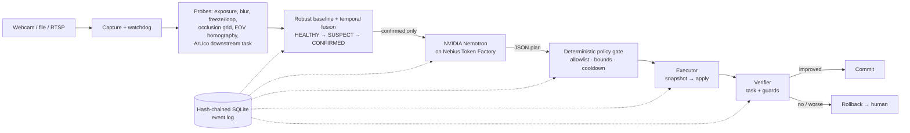

# Physical AI Reliability Agent

**An autonomous reliability layer for camera-based Physical AI.** It watches a camera, notices
when the perception pipeline stops being trustworthy, asks **NVIDIA Nemotron on Nebius Token
Factory** for a root-cause diagnosis and a plan, runs only **bounded, reversible** fixes through a
deterministic policy gate, and **keeps the change only if the downstream task measurably
recovers** — otherwise it rolls back and escalates to a human.

> Working name · Nebius x NVIDIA Global AI Hackathon 2026 · **Physical AI track** ·
> License: [Apache-2.0](LICENSE) · Status: **Phase F0 (scaffolded, not yet validated on real
> hardware)** — see [`docs/phases-and-gates.md`](docs/phases-and-gates.md)

## Why

A camera can be "online" and useless: defocused, covered, too dark, frozen on the last frame,
knocked out of position. Commercial camera-health tools already raise alerts for this. What is
missing for robots and edge AI is the **closed loop**:

```
detect → diagnose (Nemotron) → act safely → verify on the downstream task → commit or roll back
```

Verifying on the *task* matters: we measured that ArUco marker detection on our synthetic scene
fails at mild blur but succeeds again at stronger blur — image-quality metrics alone are not a
safe success criterion (consistent with Wischow et al., arXiv:2112.05456).

## How it works (MAPE-K)



| Stage | Module | Authority |
|---|---|---|
| Monitor | `capture/`, `probes/`, `tasks/marker.py` | local, deterministic, works offline |
| Analyze | `baselines/robust.py`, `incidents/fusion.py`, `incidents/state_machine.py` | deterministic |
| Plan | `nemotron/` | **advisory only** — Nemotron proposes, never executes |
| Execute | `policy/gate.py`, `actions/executor.py` | allowlist, typed bounds, cooldown, rate limit |
| Verify | `verification/verifier.py` | commit/rollback rule |
| Knowledge | `storage/event_store.py` | append-only, tamper-evident |

Non-negotiables: detection works without the cloud · Nemotron is called only after a CONFIRMED
incident · the LLM never touches the device · every action has a snapshot, timeout and rollback ·
client-side budget caps · a Token Factory outage degrades to local rules + human escalation.

## How we use NVIDIA and Nebius

- **NVIDIA Nemotron 3** (open models) via **Nebius Token Factory**'s OpenAI-compatible API
  (`https://api.tokenfactory.nebius.com/v1/`) for causal diagnosis, action selection among the
  incident's allowed actions, verification design and a human-readable explanation.
- Tiers (ADR-002): a fast Nemotron (Nano / 3.5 Lightning) for every incident; Nemotron 3 Super
  only on ambiguity. Model IDs are **verified against `/v1/models`** (`scripts/list_models.py`),
  never trusted from docs.
- Structured output with `response_format: json_schema` where the action enum is restricted to
  the actions the policy gate offers for this device; automatic fallback to JSON mode.
- Every call logs model, prompt version, tokens, latency and estimated cost to the event log.

## Quickstart

Requires Python ≥ 3.11. Works on Windows and Linux. No GPU needed for the MVP.

```bash
git clone https://github.com/aiambo08/nebiusxnvidia_hackathon.git
cd nebiusxnvidia_hackathon
python -m venv .venv
# Windows: .venv\Scripts\activate    Linux/macOS: source .venv/bin/activate
pip install -e ".[dev,api]"

pytest                                 # 220+ tests, no network, no credits
ra-demo all                            # deterministic SIMULATION of every scenario
```

Use Nemotron (spends a few cents of Token Factory credits):

```bash
cp .env.example .env                   # then set NEBIUS_API_KEY in .env (never commit it)
python scripts/list_models.py          # confirm NVIDIA model IDs available to your key
python scripts/spike_nemotron.py --n 20
ra-demo scenario dark --planner nemotron
```

Real camera (physical demo path):

```bash
ra-demo live --uri 0                   # webcam index, video file or rtsp:// URL
uvicorn --factory apps.api.main:create_app --port 8000   # read-only incident API
```

Without `NEBIUS_API_KEY` the agent starts in **local mode** (rule-based planner) and says so.

## Simulation scenarios

`ra-demo all` runs these on a seeded synthetic scene with a reference ArUco marker:

| Scenario | Expected loop |
|---|---|
| `dark` | blackout → raise exposure (bounded) → task recovers → **commit** |
| `defocus` | focus drift → autofocus → task recovers → **commit** |
| `freeze` | bit-exact repeated frames → restart capture → **commit** |
| `overexposure` | clipping → lower exposure → **commit** |
| `occlusion` | covered lens → maintenance **ticket** → waits for human → closes when clean |
| `bad_action` | a deliberately harmful plan → verification fails → **exact rollback** → human |

These are labelled SIMULATION everywhere. The hackathon video uses the real webcam.

## Repository map

```
src/reliability_agent/   capture · probes · tasks · baselines · incidents · nemotron
                         policy · actions · verification · storage · orchestrator · cli
apps/api/                read-only FastAPI over the event log (dashboard backend)
benchmarks/              seeded fault injectors, run manifests, degraded-clip builder
scripts/                 spikes/benchmarks: list_models, spike_nemotron, spike_capture, spike_static_scene, bench_probes, bench_static_scene
configs/default.yaml     every threshold, cap and model ID (no secrets)
docs/                    phase gates, compliance matrix, ADRs, safety, evaluation, budget
docs/es/                 full technical execution report (Spanish)
AGENTS.md                operating manual for the multi-agent coding team
```

## Budget: zero extra spend

Only Token Factory inference is paid, from the 30 USD hackathon credits. Client-side caps:
soft 23 USD (non-essential calls off), demo 25 USD (demo calls only), hard 27 USD (nothing
leaves the client). ≤ 2 calls per incident, cache by incident signature, compact JSON, no video
upload, no dedicated endpoints. Details: [`docs/budget.md`](docs/budget.md).

## Out of scope (frozen at F0)

Free-form robot control or dangerous actuators · automatic physical lens cleaning · training a
foundation model · managing thousands of cameras · replacing an NVR (Frigate, Shinobi, Agent DVR)
· continuous video to Token Factory · irreversible changes decided by the LLM.

## Known limitations (honest status)

- Not yet validated on real hardware; all thresholds are initial and must be recalibrated (F3–F5).
- The ArUco task does not degrade under freeze or mild overexposure, so verification of those
  faults relies on fault absence + guard metrics.
- Real UVC/ONVIF exposure/focus control is not implemented yet; on a webcam only restart, safe
  mode and tickets are available (Phase 7).
- Nemotron model IDs, regions and `json_schema` support are pending confirmation (Gate F0).

## Documentation

[Phase gates](docs/phases-and-gates.md) · [Compliance matrix](docs/compliance-matrix.md) ·
[ADR-001](docs/adr/ADR-001-architecture.md) · [ADR-002](docs/adr/ADR-002-model-selection.md) ·
[Safety model](docs/safety-model.md) · [Evaluation](docs/evaluation.md) ·
[Budget](docs/budget.md) · [Research](docs/research.md) · [Feedback log](docs/feedback.md) ·
[Demo script](docs/demo-script.md) · [Informe técnico (ES)](docs/es/informe-tecnico-ejecucion.md)

## Hackathon notes

Created during the submission period (first commit: October 2026); not a pre-existing project.
Built with AI coding assistants under the human author's direction; design decisions are
recorded in `docs/agents/DECISIONS.md` and `docs/adr/`.

## License

Apache License 2.0 — see [LICENSE](LICENSE) and [NOTICE](NOTICE).
